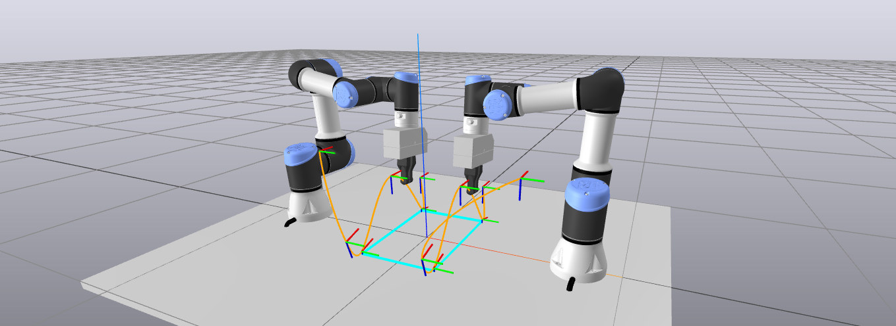

# AIRO-Drake
Scripts and notebooks to test the [Drake](https://drake.mit.edu/) robotics toolbox for our use cases at AIRO.

# Installation
First build drake from [source](https://drake.mit.edu/from_source.html), then in this repo do:
```
conda env create -f environment.yaml
conda activate drake
conda develop ~/drake-build/install/lib/python3.8/site-packages/
```
When installing drake through pip, not all models are included due to their large size. 

# Usage
You can start exploring by running the [notebooks](notebooks).